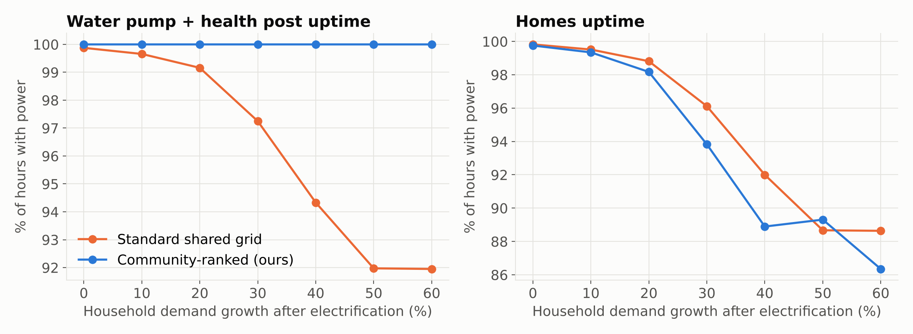
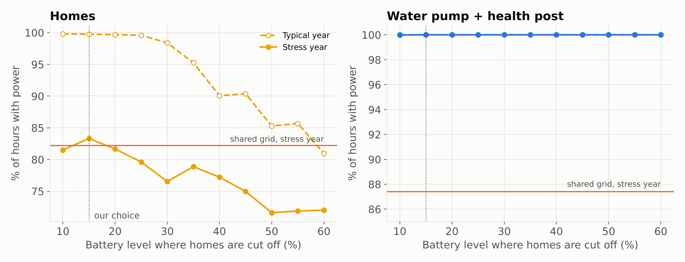
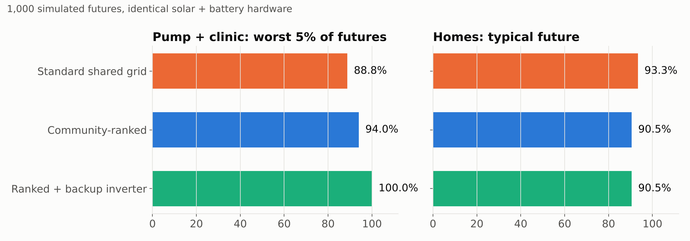
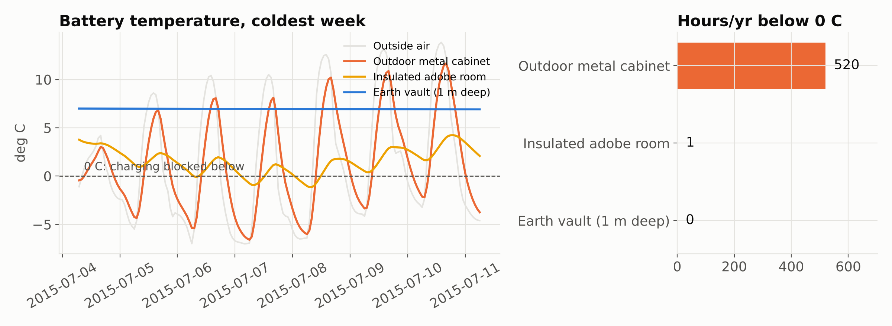

# Luz Primero


**When the battery runs low, the community decides what stays on.**

A community-ranked solar microgrid for Ancotanga (Caracollo, Oruro, Bolivia), simulated hour by hour over 20 years of NASA satellite weather.

Team **Altiplano Power Lab** (Sripal Konchada, Atul Bhat). Caltech EWB Science & Engineering Competition 2026, High School Category, Prompt 5: Community-Led Energy Infrastructure in the Bolivian Altiplano.

## The idea

A normal solar microgrid shares one battery. When it runs short, everyone loses power, including the water pump and the health post.

In our design, the community ranks its loads:
1. Water pump
2. Health post
3. School
4. Homes

Loads are served in rank order, and each one can only drain the battery down to its own cut-off level. The school and homes stop at 15% charge, so the last stored energy is saved for the pump and the clinic. The 15% level was chosen by an optimizer (below), not by hand. A community assembly sets the ranking and can change it.

## Key results (real data, 2005 to 2024)

Design chosen: **10 kW solar, 40 kWh LFP battery**. It's the cheapest of 120 sizes tested that keeps the pump and clinic on at least 99.5% of hours and homes on at least 95%.

| Finding | Result |
|---|---|
| Solar resource | 2,117 kWh per kW of panels per year; 6.38 kWh/m²/day |
| Cold | 802 hours/yr below 0 °C; coldest hour −8.9 °C |
| Demand growth (+50%) | Pump + clinic uptime: **100%** with ranking vs **92.0%** on a shared grid; homes 89.3% vs 88.7% |
| Cut-off optimization | 66 combinations in a stress year. 15% keeps pump + clinic at 100% and gives homes 83.3%, vs 76.5% at a 30% cut-off and 82.2% on a shared grid |
| 1,000 random futures | Ranked grid kept pump + clinic at 100% in all 901 futures with no inverter failure |
| Inverter breakdowns | Worst 5% of futures: 88.8% (shared), 94.0% (ranked), **100%** (ranked + $600 backup inverter) |
| Homes in a typical future | 90.5% (ranked) vs 93.3% (shared) |
| Battery housing | Metal cabinet: 520 h/yr below 0 °C. Insulated adobe room: 1 h. 1 m earth vault: 0 h |
| Cost per kWh | **$0.44 solar vs $1.00 diesel** (20 years, 8% discount rate) |
| Diesel avoided | 6,190 L/yr, about 16.6 t CO₂/yr |






All numbers are in `results/results.json`. The raw runs are in `results/sizing_sweep.csv` and `results/monte_carlo.csv`.

## Run it yourself

```
pip install -r requirements.txt
python run_all.py data/nasa_power_ancotanga.csv
```

This takes about 4 minutes on a laptop and rewrites everything in `results/`. Running `python run_all.py` with no file uses fake test weather, and every figure is watermarked "TEST DATA".

To test a different assumption, change a number in `config.py` and rerun.

Two more commands:

```
python optimize_floors.py data/nasa_power_ancotanga.csv   # cut-off optimizer, about 1 minute
python -m pytest -q                                       # 16 tests, about 2 seconds
```

## Why 15%? The cut-off optimizer

`optimize_floors.py` tests every combination of school and home cut-offs from 10% to 60% (66 per scenario) over the full 20-year record, in two scenarios:

- **Typical year:** new system, today's demand
- **Stress year:** 15-year-old panels, heavy dry-season dust, battery faded to 82%, household demand +50%

The selection rule was fixed before looking at results: give homes the most uptime in the stress year, while keeping the pump and clinic on at least 99.99% of hours. The winner was 15% for both school and homes.

The finding: **serving loads in priority order does almost all of the protecting.** Bigger reserves only take power away from homes. We originally picked 30% by hand; the optimizer showed that cost homes about 7 points of uptime in a bad year for no gain.

## Tests

`tests/test_model.py` checks the model against physics and its own rules, and runs automatically on GitHub after every upload:

- No solar at night, and panel output stays physically bounded
- Colder panels produce more power (negative temperature coefficient)
- Battery charge never goes below 10% or above 100%
- The battery never charges below 0 °C
- A lower-ranked load never gets power while a higher-ranked one is cut off
- Ranking beats a shared grid on an undersized system
- A bigger battery never lowers reliability
- The backup inverter keeps the pump and clinic on during a repair, and panels keep charging the battery
- Daily load totals match `config.py`, and pump energy matches E = ρgVh / η
- The soil damping depth matches √(2α/ω)
- The capital recovery factor matches the textbook value (8%, 20 years = 0.10185)

The tests caught a real bug: the first version stopped all battery charging while the main inverter was broken. In a DC-coupled system, the panels keep charging through the separate charge controller. We fixed it.

## Files (read them in this order)

| File | What it does |
|---|---|
| `config.py` | Every assumption, with a note on where it came from. Start here. |
| `weather.py` | Reads the NASA POWER file and converts it to hourly UTC data |
| `pv_model.py` | Converts sunlight to panel output: sun position, tilt, cell temperature (pvlib) |
| `loads.py` | Hourly demand for the pump, health post, school, and 60 homes |
| `battery_temp.py` | Battery temperature in 3 housings: thermal lag model + soil heat diffusion |
| `dispatch.py` | Runs the grid hour by hour, ranked vs. shared (the core logic) |
| `montecarlo.py` | 1,000 random futures: weather year, dust, aging, demand growth, inverter failures |
| `economics.py` | 20-year cost per kWh (LCOE), solar vs. diesel |
| `plots.py` | All figures |
| `run_all.py` | Runs the full study |
| `optimize_floors.py` | Searches all cut-off levels in a typical and a stress year |
| `tests/test_model.py` | 16 automated tests |

## Methods in brief

- **Weather:** NASA POWER hourly irradiance, 2 m temperature, and 10 m wind at lat −17.77, lon −67.44 (175,320 hours).
- **Panels:** pvlib with Erbs decomposition, Hay-Davies transposition, and Faiman cell temperature. North-facing, 25° tilt, −0.35%/°C, 12% system losses.
- **System:** DC-coupled. Panels charge the battery through an MPPT charge controller; a main inverter feeds all loads, and a 1.5 kW backup inverter feeds only the pump and clinic.
- **Battery:** LFP with 92% round-trip efficiency, 10% minimum charge, and 0.5C power limit. Charging is blocked below 0 °C, and capacity drops to 80% at −10 °C.
- **Earth vault:** annual temperature amplitude damped by exp(−z/d), with damping depth d = √(2α/ω). That gives 2.24 m for soil diffusivity 5×10⁻⁷ m²/s.
- **Economics:** 8% discount rate and 20-year life. The battery and inverter are replaced at year 10. Diesel is $1.63/L (Bolivia's price since Sept 19, 2026) plus $0.15/L transport, at 0.45 L/kWh.

## Limitations

- Loads are engineering estimates. A real pilot would start with a metered load survey.
- NASA temperatures are averages over a roughly 50 km area, so real nights may be colder.
- The soil model uses air temperature as the surface temperature. That's conservative, because sunny Altiplano soil is usually warmer than the air.
- Costs are published benchmarks, not supplier quotes.

## Data and references

- NASA POWER Project, power.larc.nasa.gov
- Holmgren, Hansen & Mikofski (2018). pvlib python. *Journal of Open Source Software* 3(29), 884
- ESMAP / World Bank (2022). *Mini Grids for Half a Billion People*

## AI use

## AI use

We used Claude (Anthropic) to brainstorm the project direction and site selection,
find and check sources, and draft the slides. An earlier version of our simulation,
which produced the figures and results in our pitch deck, was written with Claude's
help. We then wrote our own implementation of the model, published in this repository,
and can explain every assumption and result.

## License

MIT
